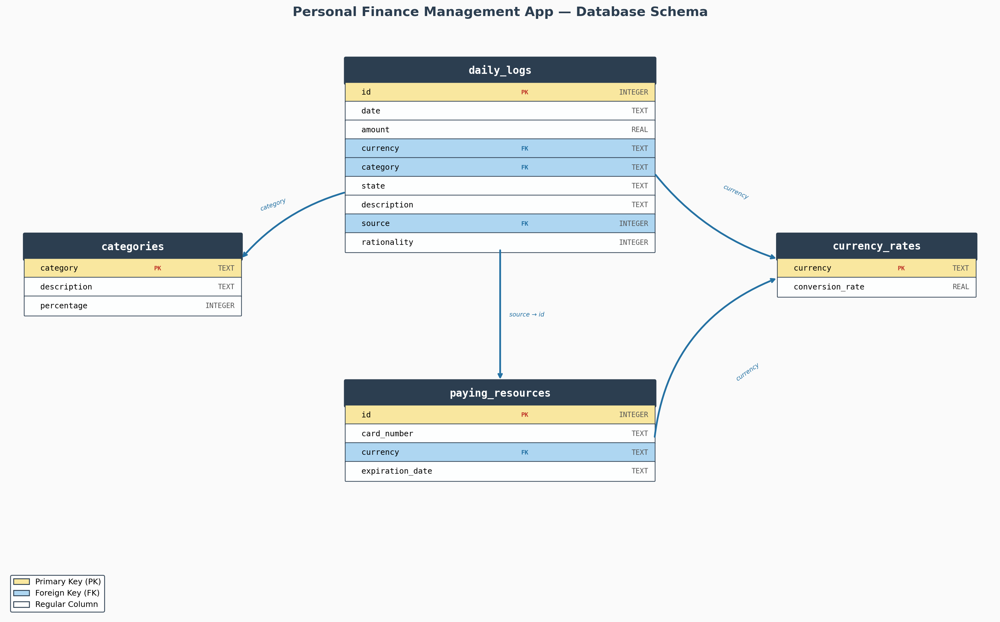

# Personal Finance Management App

A SQLite database that tracks daily income and expenses across multiple currencies, payment sources, and spending categories. It converts all amounts to USD for unified reporting and compares actual spending against a planned monthly budget.

## Schema Overview

### Tables

**`currency_rates`** (4 rows) — Stores a conversion multiplier for each supported currency (USD, EUR, UAH, JPY) so that any transaction can be normalized to USD.

**`categories`** (12 rows) — Defines 12 spending categories (food, housing, health, entertainment, education, transport, clothing, personal care, gifts, savings, miscellaneous, and income). Each category has a description of what it covers and a `percentage` field representing the recommended share of monthly income that should go to that category.

**`paying_resources`** (9 rows) — Lists payment methods: 5 bank cards (with card number, currency, and expiration date) and 4 cash entries (one per currency). Acts as the source reference for every transaction.

**`daily_logs`** (30 rows) — The main transaction ledger. Each row records the date, amount, currency, category, whether it is income or expense, a text description, which payment source was used, and a rationality flag indicating whether the purchase was considered a wise decision.

## Queries

1. **What is my income and expenses for the last month in USD?** — The most fundamental budgeting question. Knowing the balance between income and expenses tells the user whether they are living within their means or overspending.

2. **In what categories did I spend more than planned?** — Compares actual spending per category against the budgeted percentage of total income. Highlights areas that need attention so the user can adjust habits or reallocate their budget.

3. **For what category did I spend the most and how much in USD?** — Identifies the single biggest cost driver. Helps the user decide where to cut back first if savings are needed.

4. **What percentage of my spending was irrational?** — Surfaces impulsive or unnecessary purchases by aggregating all transactions marked as irrational. Seeing the total lost to unplanned spending motivates behavioral change.

5. **How much did I spend from each payment source?** — Reveals which card or cash method dominates spending. Useful for optimizing credit-card rewards, tracking cash leakage, or consolidating accounts.
