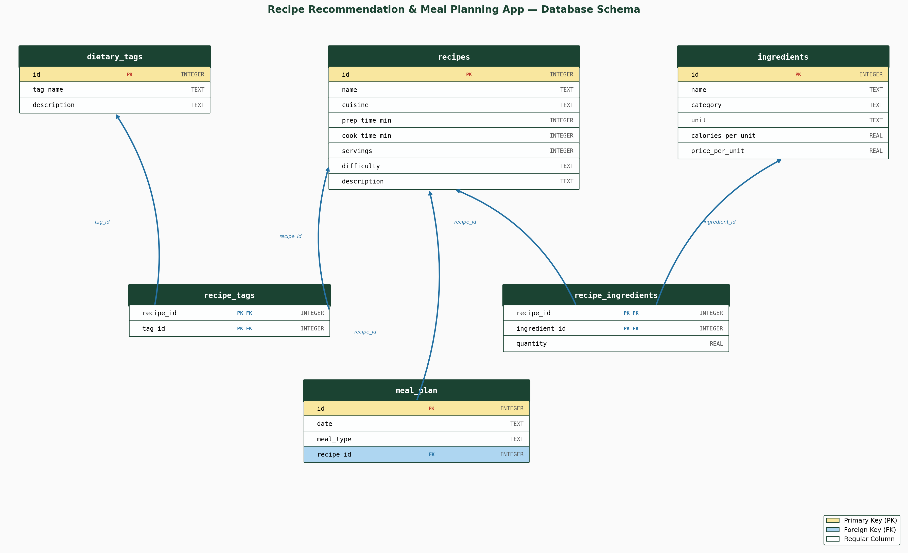

# Recipe Recommendation and Meal Planning App

A SQLite database for organizing recipes, tagging them with dietary labels, and building a weekly meal plan. It tracks ingredients with calorie and cost data so users can generate shopping lists, estimate daily nutrition, and stay within a grocery budget.

## Schema Overview

### Tables

**`dietary_tags`** (7 rows) — A catalog of dietary labels (vegan, vegetarian, gluten-free, dairy-free, low-carb, high-protein, nut-free) with a short description of what each tag means.

**`ingredients`** (20 rows) — Master list of ingredients grouped by category (meat, seafood, dairy, grains, produce, legumes, protein, oils). Each entry stores the measurement unit, calories per unit, and price per unit.

**`recipes`** (10 rows) — Core recipe information: name, cuisine type, prep time, cook time, number of servings, difficulty level (easy / medium / hard), and a short description.

**`recipe_ingredients`** (43 rows) — Junction table that links each recipe to its required ingredients and specifies the quantity needed. Enables aggregation of calories and cost across recipes.

**`recipe_tags`** (33 rows) — Junction table that links recipes to their applicable dietary tags, allowing filtering by dietary restrictions.

**`meal_plan`** (21 rows) — A weekly schedule (7 days, 3 meals per day) that assigns a recipe to each meal slot (breakfast, lunch, dinner). Serves as the basis for shopping-list generation and daily nutrition summaries.

## Queries

1. **What ingredients do I need to buy for this week's meal plan?** — The core value of a meal planning app. Aggregates quantities and estimated costs across all planned meals into a single shopping list so nothing is forgotten or double-bought.

2. **Which recipes can I make in under 30 minutes?** — Time is the most common constraint for home cooks. Filtering by total time (prep + cook) lets users quickly find fast options on busy weekday evenings.

3. **What is the estimated calorie count for each day?** — Essential for users managing their weight or following a nutrition plan. Provides a daily overview without needing a separate calorie-counting tool.

4. **Which recipes are suitable for a vegan diet?** — Dietary restrictions are non-negotiable for many users. Filtering recipes by tag lets them (or their guests) quickly identify safe options. The same pattern works for any dietary tag.

5. **What is the estimated total cost of my weekly meal plan?** — Budget visibility broken down by day lets users spot expensive meals and swap them for cheaper alternatives, keeping groceries within their financial plan.
